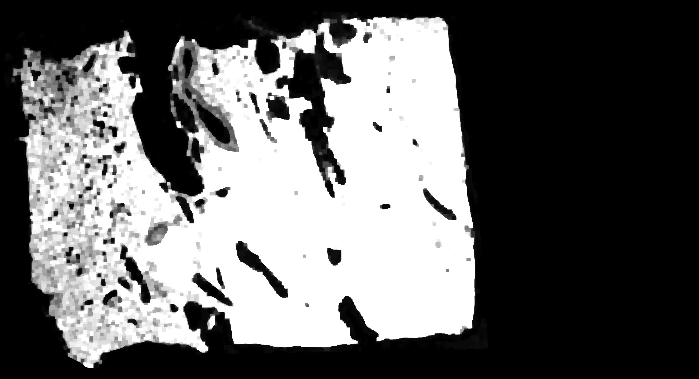
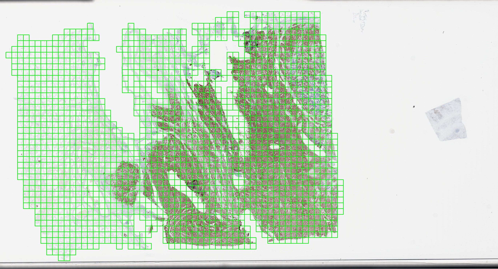
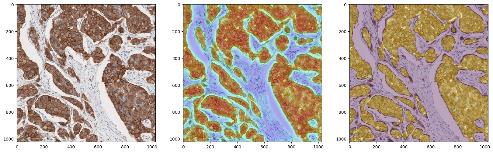

# c-MET

## patch generation

- ROI mask: tissue region to be analyzed (excluding artifacts such as internal control, black lines, dust, and so on)
- tissue mask: otsu's thresholding -> sobel edge detection
- blurrity check: variance of gray-scale image fed into laplacian filter 
- thresholds: tissue threshlod = 0.1 / variance for blurrity check = 100

tissue mask

patch extraction (200x)

## tumor segmentation

- U-Net
- data collection and annotation

patch (200x, 1024x1024) / heatmap overlay / predicted tumor region 
